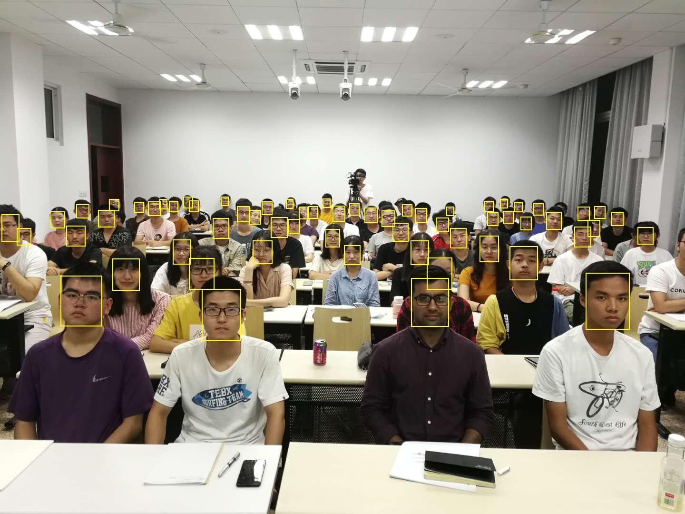

# CV & AI Project 2019


## Files
- `src/` the source code of our project
- `results.ipynb` show the face detection results
- `training.ipynb` train the MTCNN
- `data.dat` the face detection result(face box data).

The jupyter files demonstrate the usage of our program.

## Dependency

To run our code for face detection, you should have `pytorch` installed.
If not, use `pip intsall torch` to install pytorch.

## Usage
 
First, import the functions and modules we need.

```python
from src import detect_faces, show_bboxes
from PIL import Image
```
Suppose you have a test image, and its path is `path/to/image`  

```python
img = Image.open('path/to/image')
bb, _ = detect_faces(Image.open(img))
img0 = show_boxes(img, bb, 'yellow', 3)
```

## Face Detection Demo
